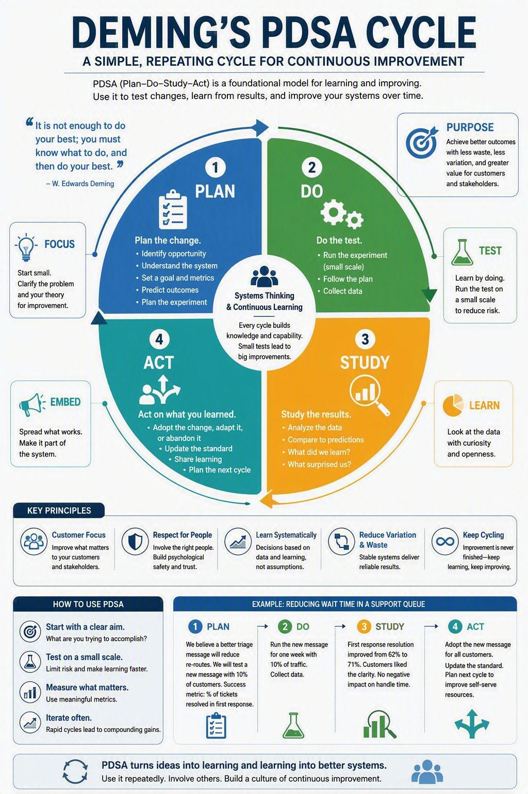

# Deming

Deming is a set of agent instructions and skills for the Agent Development Lifecycle. It uses the Plan, Do, Study, Act cycle to guide work on code, documentation, tests, and development processes.

## PDSA cycle



## How it works

Before an implementation change, Deming reads the supplied task spec and asks whether to use a PDSA cycle or make the change directly only if you have not already chosen. Explicit spec drafting follows the separate path below. A user-provided task spec explicitly requiring PDSA counts as that choice; it does not replace scope confirmation. Reviewing a spec or merely mentioning PDSA does not authorize a cycle, and a later explicit direct choice overrides the spec. Direct work means inspect, change, verify, and summarize—without cycle records or an automatic task branch. Read-only questions and planning discussions need neither a cycle nor a workflow question. The authoritative [workflow choice gate](deming.system.md#workflow-choice) defines selection and continuation.

## Spec sessions

Use the built-in [Spec skill](skills/spec/SKILL.md) when you want to turn an idea into a focused, editable requirements draft before implementation, for example: “Let's do a spec session for …”. Deming researches facts from the project, interviews material decisions in dependent rounds, writes an early `specs/<descriptive-name>.md` draft from [the Spec template](templates/spec.md), and hands the file to VS Code when the `code` CLI is available. It preserves existing drafts and user edits, and reports a path-based fallback when an editor is unavailable.

A spec session is a collaboration surface, not a PDSA cycle or implementation approval. “This spec looks right” confirms the requirements; “implement it” is a separate authorization. At that point, an explicitly selected workflow uses Direct work or the existing PDSA path, whose Plan phase consumes the agreed spec and creates the HTML implementation plan. Proposed or illustrative PDSA text in a draft cannot start a cycle by itself. Specs are normal project artifacts; ignored `.deming/cycles/` records remain separate.

The template retains **How You Are Graded** for meaningful rubrics: user-selected weights, partial-credit rules, and hard failures. Recommendations stay proposals until you adopt them. Review-only requests remain read-only; drafting/refinement allows scoped spec edits. Unchanged confirmed scope and a user-adopted workflow carry forward without another approval loop.

### Implementation through PDSA

When you select PDSA, the four phase skills ask the agent to predict what a change will do, make the change, and use the results to decide what to do next:

1. [Plan](skills/plan/SKILL.md). Create an HTML implementation plan: purpose/problem/solution, prediction, scope, acceptance criteria, ordered tasks, phase testing strategies, and useful validated diagrams.
2. [Do](skills/do/SKILL.md). Execute that plan phase by phase, update its checklist, run phase and global validation, and record evidence without rewriting the original prediction.
3. [Study](skills/study/SKILL.md). Review the change, run focused tests, and compare the evidence with the prediction. Record what the agent learned and what remains uncertain.
4. [Act](skills/act/SKILL.md). Adopt, revise, or abandon the change. Update the instructions or standards that need to change, or plan another experiment. Get authorization before pushing a branch or opening a pull request.

[SOUL.md](SOUL.md) defines Deming's voice, values, and boundaries. [deming.system.md](deming.system.md) sets the workflow and tells the agent when to use each skill.

## Cycle records

For a user-selected PDSA change, Plan starts a cycle in the target repository after scope confirmation. For an explicitly requested new project in an empty directory outside another repository, Plan may initialize Git on `main` and make an empty baseline commit, recording that bootstrap in the plan. Pre-existing files or an existing unborn repository require an explicit baseline decision; the setup script never initializes or commits for you.

Choose a lowercase cycle name and start from the intended base branch with a clean working tree and at least one commit. The script assigns the next three-digit number from existing local cycle records and `deming/*` refs:

```powershell
powershell -NoProfile -ExecutionPolicy Bypass -File "$HOME\.deming\scripts\start-cycle.ps1" -Name adr-crud -Repo C:\src\adr-ui
```

Use your actual Deming installation path if different. If the next number is `001`, the script creates and checks out `deming/001-adr-crud`; if local history already reaches `003`, it creates `deming/004-adr-crud`. It then copies four templates:

```text
adr-ui/
└── .deming/cycles/004-adr-crud/
    ├── plan.html
    ├── do.md
    ├── study.md
    ├── act.md
    └── diagrams/             # created by Plan only when useful
        ├── overview.html    # canonical diagram source
        └── overview.svg     # extracted asset embedded in plan.html
```

The four files begin as pending scaffolds, not completed phase outputs. Plan fills `plan.html`; Do executes and updates its checklist while filling `do.md`; Study consumes both and fills `study.md`; Act records the disposition in `act.md`. The HTML plan is the single source of truth, not a duplicate of a Markdown plan or a generated plan under `specs/`. Resume by giving Deming the existing cycle directory, not by rerunning setup. Records are local-only and ignored: setup adds `/.deming/` to `.gitignore` when needed. Commit the ignore rule with the application changes, not the records. Existing tracked history is preserved. Ignored records support local session recovery but do not travel with a clone; summarize necessary evidence and decisions in the authorized PR or handoff.

Setup accepts ignored cycle paths and refuses dirty repositories, detached HEADs, and existing cycle directories or task branches. It does not commit, push, or merge. If writing fails after branch creation, inspect the retained branch and partial files before proceeding.

Cycle closure is separate from accepting behavior. Study records passed, failed, or untested criteria with their evidence; Act carries every unresolved required criterion into an explicit required handoff. An HTTP response or a mock-storage test is not proof that the browser UI works.

### HTML planning and diagrams

Plan integrates guidance from Plan F3 and Diagram Design directly; those external skills are not installed or required. The plan carries append-only metadata and amendments, scoped implementation phases, `[]` / `[wip]` / `[x]` / `[f]` markers, per-phase testing strategies, and global validation. Do links checklist results to evidence in `do.md`; failed prerequisites stop dependent work. Readiness, execution completion, and behavioral acceptance are separate claims.

Use diagrams only when they explain more than prose or a table. Keep static HTML sources and extracted SVGs under the cycle's ignored `diagrams/` directory, with shared visual tokens and accessible labels. Plan includes selection, complexity, geometry, and browser-review guidance. Bundled checks need only PowerShell, not the original skills or a Python package:

```powershell
powershell -NoProfile -ExecutionPolicy Bypass -File scripts\plan-artifacts.ps1 -Mode Diagram -Path <cycle>\diagrams\overview.html
powershell -NoProfile -ExecutionPolicy Bypass -File scripts\plan-artifacts.ps1 -Mode Export -Path <cycle>\diagrams\overview.html -OutputPath <cycle>\diagrams\overview.svg
powershell -NoProfile -ExecutionPolicy Bypass -File scripts\plan-artifacts.ps1 -Mode Plan -Path <cycle>\plan.html
# Add -Completed only when every phase/task/test marker should be [x].
```

Resolve these script paths from your Deming installation when working in another repository. Author XML-compatible HTML (balanced tags, quoted attributes, self-closing void tags, escaped text) for the structural checker. The helper verifies structure and source/SVG consistency, not semantic correctness, browser geometry, or safety of arbitrary untrusted HTML. Browser/visual inspection remains a separate check. Fonts have explicit local fallbacks so artifacts do not require network font loading.

Old cycles containing only `plan.md` remain resumable without automatic conversion. If both formats exist, an explicit authoritative-plan handoff is required; otherwise Deming asks. See the [cycle plan format contract](deming.system.md#cycle-plan-format).

## Install for Pi

The PowerShell installer installs Pi if needed, clones Deming to `$HOME\.deming`, and adds its instructions and skills to your global Pi configuration. Deming then applies across projects for your user account.

Install Git first, then run this in PowerShell:

```powershell
powershell -NoProfile -ExecutionPolicy Bypass -Command "irm https://raw.githubusercontent.com/ianphil/Deming/master/install.ps1 | iex"
```

Restart Pi or run `/reload` after installation.

### Inspect the installer

To read the script before running it:

```powershell
irm https://raw.githubusercontent.com/ianphil/Deming/master/install.ps1 -OutFile "$env:TEMP\deming-install.ps1"
Get-Content "$env:TEMP\deming-install.ps1"
powershell -NoProfile -ExecutionPolicy Bypass -File "$env:TEMP\deming-install.ps1"
```

### Update

To update an existing installation:

```powershell
powershell -NoProfile -ExecutionPolicy Bypass -File "$HOME\.deming\install.ps1"
```

### Startup version check

Deming reports its installed path, commit, and update status once per session before project work. The check script never merges or updates working files:

```powershell
# Local-only: compare against cached upstream information.
powershell -NoProfile -ExecutionPolicy Bypass -File "$HOME\.deming\scripts\check-update.ps1"

# With network permission: fetch the configured upstream remote first.
powershell -NoProfile -ExecutionPolicy Bypass -File "$HOME\.deming\scripts\check-update.ps1" -Fetch
```

`Status` is `current`, `behind`, `ahead`, `diverged`, `modified`, or `unknown`. `Freshness` distinguishes a cached comparison from a successful fetch or an unavailable fetch. A failed check reports uncertainty rather than blocking project work. `-InstallDir` can select another installed clone; by default the script checks the clone containing itself, not the current project.

Deming asks before updating a behind installation and uses a fast-forward-only merge after a fresh, clean check. It preserves local changes and stops for a fresh session after updating. Restarting or `/reload` alone does not download new files. Older installations need the one-time update above before they can follow this startup rule.

### Custom location

Both `install.ps1` and `uninstall.ps1` accept `-InstallDir` when you run them locally. Relative paths resolve from the current PowerShell directory. Use the same location when updating or uninstalling.

## Uninstall

The uninstaller removes Deming's global Pi configuration. It keeps the clone, including local commits, stashes, and ignored files. It also leaves Pi, other settings, skills, credentials, and sessions intact.

```powershell
powershell -NoProfile -ExecutionPolicy Bypass -Command "irm https://raw.githubusercontent.com/ianphil/Deming/master/uninstall.ps1 | iex"
```

`-KeepRepository` still works, but keeping the clone is now the default.

### Delete the clone too

`-RemoveRepository` deletes local commits, stashes, and ignored files too. Back them up first.

Download the uninstaller outside the clone, then pass `-RemoveRepository`:

```powershell
irm https://raw.githubusercontent.com/ianphil/Deming/master/uninstall.ps1 -OutFile "$env:TEMP\deming-uninstall.ps1"
powershell -NoProfile -ExecutionPolicy Bypass -File "$env:TEMP\deming-uninstall.ps1" -RemoveRepository
```

The script refuses to delete the clone if it cannot verify the origin, the working tree has uncommitted changes, or the script is running from the installation directory.

## Run the tests

Run the regression checks from the repository root with Windows PowerShell 5.1 and PowerShell 7:

```powershell
powershell -NoProfile -ExecutionPolicy Bypass -File tests\installer.tests.ps1
pwsh -NoProfile -File tests\installer.tests.ps1
powershell -NoProfile -ExecutionPolicy Bypass -File tests\cycle.tests.ps1
pwsh -NoProfile -File tests\cycle.tests.ps1
powershell -NoProfile -ExecutionPolicy Bypass -File tests\plan-artifacts.tests.ps1
pwsh -NoProfile -File tests\plan-artifacts.tests.ps1
powershell -NoProfile -ExecutionPolicy Bypass -File tests\update.tests.ps1
pwsh -NoProfile -File tests\update.tests.ps1
powershell -NoProfile -ExecutionPolicy Bypass -File tests\spec-skill.tests.ps1
pwsh -NoProfile -File tests\spec-skill.tests.ps1
```

### Workflow-choice and HTML-plan evaluation

Use the [workflow-choice regression scenarios](tests/workflow-choice.md) in fresh sessions with the candidate instructions to check direct work, choice prompts, task-spec approval, HTML planning/diagrams, ordered Do execution, explicit or resumed PDSA, and collaborative Spec sessions (cases 17 onward). The Spec suite checks document structure and local references, not model behavior. These are behavioral checks, not proof supplied by the PowerShell suites.

### Live Pi evaluation (opt-in)

`tests/pi-e2e.ps1` runs a real `pi -p --mode json` session using your existing provider credentials. It consumes model tokens. Supply an **empty** target directory and a new evidence directory outside the target; the harness never deletes a project:

```powershell
pwsh -NoProfile -File tests\pi-e2e.ps1 -Repo C:\src\adr-ui -EvidenceDir C:\src\Deming\.deming\e2e-run-01
```

The harness uses the candidate checkout's installer instructions and skills in a temporary isolated Pi configuration, preserves sessions and candidate hashes, and removes its temporary credential copy afterward. It does not update the global installation. The trial permits local Git bootstrap/commits and browser testing, but not remote fetches, publishing, package installation, or global changes.

A successful Pi exit is **not** a passing evaluation. Inspect the saved session for startup ordering, bootstrap, phase handoffs, ignored records, real browser evidence, and required follow-up in Act. Independently rerun generated checks. Keep failed trials and interventions in the parent cycle's Study record.

The checks use temporary configuration and repositories. Installer checks replace Pi installation and network updates with test functions and leave your real Pi configuration untouched. Cycle checks exercise branch creation, template rendering, and refusal of unsafe or conflicting setup requests without network access. Update checks use local Git repositories to exercise version reporting and fetch failures; they do not contact GitHub or change the installed Deming.
